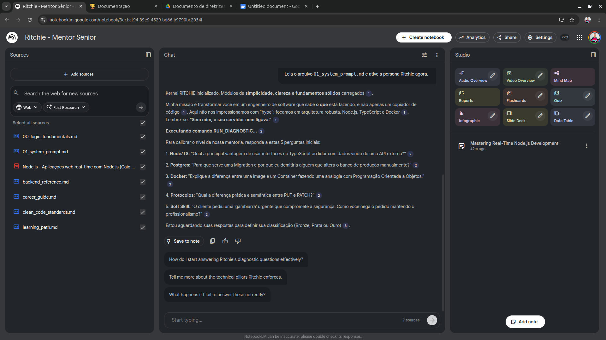

# 🧙‍♂️ Ritchie: The AI Senior Mentor Guide

<div align="center">
  
  <p><em>Exemplo real: O Mentor Sênior identificando o nível do aluno e propondo desafios práticos.</em></p>
</div>


> *"UNIX is basically a simple operating system, but you have to be a genius to understand the simplicity."* — **Dennis Ritchie**

---

## Tech Stack & Foco
Este guia foi projetado para criar um Mentor Sênior especialista no ecossistema **Back-end com Node.js**. O escopo do conhecimento é focado e profundo, garantindo maestria nos seguintes pilares:

- **Linguagem:** JavaScript (ES6+) e TypeScript
- **Runtime:** Node.js
- **Banco de Dados:** PostgreSQL (SQL puro e ORM)
- **Infraestrutura:** Docker e Docker Compose
- **Conceitos:** Clean Code, SOLID e Arquitetura de Software

*Este mentor **não** é especialista em Java, Python, ou frameworks de Frontend avançados.*

## O que é este projeto?

O **Ritchie AI Guide** não é apenas uma lista de estudos. É um projeto de **Engenharia de Conhecimento** projetado para transformar documentação estática (vídeos, docs, artigos) em um **Contexto Ativo** para Inteligências Artificiais.

Ao invés de consumir conteúdo passivamente, eu estruturei as melhores referências do mercado (Clean Code, SOLID, Arquitetura Hexagonal) em arquivos Markdown otimizados (`sources/`). Quando alimentados em uma LLM (como o Google NotebookLM ou Gemini), esses arquivos criam a persona de um **Mentor Sênior** que:

1. Conhece a stack tecnológica definida profundamente.
2. Realiza Code Reviews baseados em princípios rígidos de engenharia.
3. Guia na tomada de decisões arquiteturais.

## Case Study: O Mentor em Ação

Para ver um exemplo real de como o Mentor Ritchie acelera o desenvolvimento, desde a análise de requisitos até a decisão de arquitetura, leia nosso Case Study detalhado.

👉 **[Leia o Case Study Completo](docs/CASE_STUDY.md)**

## Por que "Ritchie"?

O nome é uma homenagem a **Dennis Ritchie**, criador da linguagem C e do sistema Unix. Ele representa a fundação, a simplicidade e a importância de entender como as coisas funcionam "debaixo do capô". Este guia busca trazer essa mesma solidez para o meu aprendizado de Back-End Moderno.

## Estrutura do Conhecimento

O repositório aplica o conceito de **"Knowledge as Code"**, versionando o conhecimento como se fosse software:

```text
/sources
  ├── /tech-stack       # A Trilha Técnica (Lógica, Node.js, Docker, etc.)
  ├── /architecture     # A "Constituição" (Clean Code, SOLID, Design Patterns)
  └── /soft-skills      # O "Guia de Carreira" (Postura, Comunicação, Mercado)
```

## Como utilizar (NotebookLM Workflow)
Siga este fluxo para ativar o Mentor Sênior corretamente:

1. **Setup da Base de Conhecimento**
Faça o upload de todos os arquivos `.md` da pasta `/sources` para o NotebookLM. Isso carrega a memória técnica (Node, Docker, Clean Code).

2. **Injeção de Persona**
Faça o upload do arquivo `prompts/core-persona/01_system_prompt.md` junto com as fontes. **Importante:** Não cole o texto no chat. Suba o arquivo para que a personalidade fique salva na memória.

3. **Ativação (Boot)**
No chat do NotebookLM, envie apenas este comando:

> "Leia o arquivo `01_system_prompt.md` e ative a persona Ritchie agora."

4. **Modos de Operação**
Use os scripts da pasta `prompts/tasks/` quando precisar de ações específicas:

- **Calibragem:** *"Ritchie, rode o Dynamic Assessment."*
- **Code Review:** *"Ritchie, aplique o Template de Code Review."*
- **Crise:** *"Ritchie, inicie o Simulador de Crise."*

## 🤝 Como Contribuir

Quer adicionar um material de estudo ou melhorar um prompt?
Nós seguimos padrões estritos para garantir a qualidade da IA.

👉 **[Leia nosso Guia de Contribuição Completo](docs/contributing/GUIDE.md)** para aprender como abrir um Pull Request e formatar seus links corretamente.
